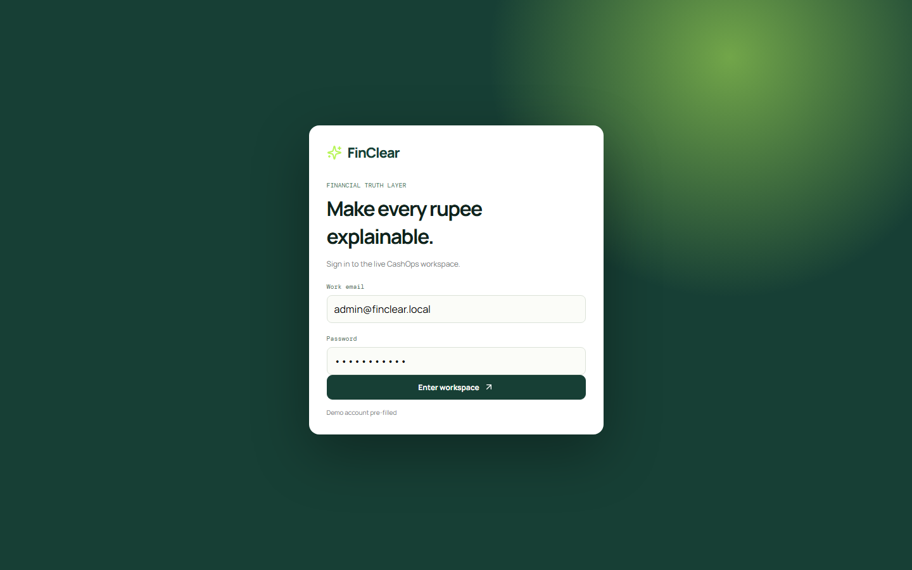
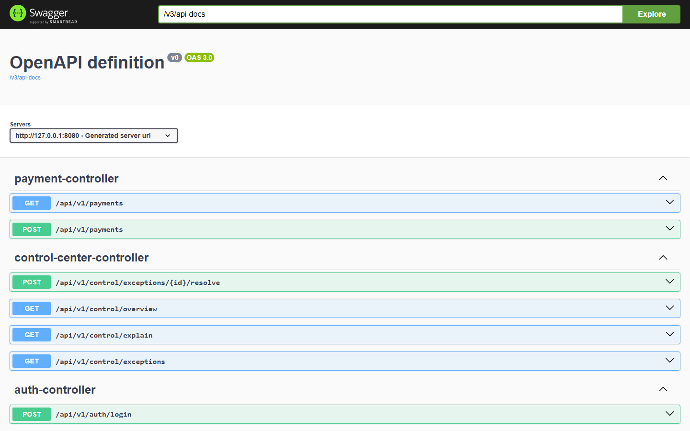

# FinClear - CashOps Command Center for Modern Payments

> A CashOps command center that makes every payment, balance, and reconciliation issue explainable.





## The problem

Finance teams often track invoices, payments, settlements, refunds, and ledger entries in different systems. When amounts do not match, they must manually reconstruct what happened.

## The solution

FinClear gives operators one workspace to:

- view available cash, payment activity, and money at risk
- investigate reconciliation exceptions with evidence and ownership
- create controlled payment records
- trace every action through a ledger record, audit log, and event trail

## Product flow

```text
Operator signs in -> reviews exceptions -> creates a payment
       -> balance is checked and locked -> payment is posted
       -> journal entry + audit log + outbox event are recorded
```

## Screenshots

| Operations console | Live REST API documentation |
| --- | --- |
|  |  |

## Tech stack

| Area | Tools used |
| --- | --- |
| Frontend | React, TypeScript, Vite, HTML, CSS |
| Backend | Java 17, Spring Boot, Spring Security, Spring Data JPA, REST APIs, JWT |
| Database | MySQL 8, Flyway migrations, H2 local demo database |
| DevOps | Docker, Docker Compose, Nginx, GitHub Actions CI |
| Testing | JUnit 5, Spring Boot integration tests, MockMvc |
| Observability | Spring Boot Actuator health and metrics endpoints |
| Event-ready architecture | Transactional outbox model, Redis and Kafka Compose services |

## Financial correctness and security

- **Idempotency keys** stop a retry from creating a duplicate payment.
- **Pessimistic account locking** protects the balance during concurrent debit requests.
- **BigDecimal** and fixed-precision database columns are used for money.
- **Balanced journal entries** record every payment in the simplified double-entry ledger.
- **JWT authentication** protects API endpoints.
- **Audit logs** preserve the actor and action history.
- **Transactional outbox events** make payment changes ready for reliable event publishing.

## Run locally

Requirements: Node.js 20+, Java 17+, and Maven 3.9+.

```bash
# terminal 1
cd backend
mvn spring-boot:run -Dspring-boot.run.profiles=demo
```

```bash
# terminal 2
cd frontend
npm install
npm run dev
```

Open [http://127.0.0.1:5173](http://127.0.0.1:5173).

```text
Email:    admin@finclear.local
Password: Admin@12345
```

Useful local links:

- API documentation: [Swagger UI](http://127.0.0.1:8080/swagger-ui/index.html)
- Service health: [Actuator health](http://127.0.0.1:8080/actuator/health)

## Quality checks

```bash
cd backend && mvn test
cd frontend && npm run build
```

The integration test verifies login, payment idempotency, balance deduction, journal creation, audit logging, and outbox creation in one end-to-end workflow.

## Docker workspace

With Docker Desktop installed, start the complete local stack:

```bash
docker compose up --build
```

This starts the React/Nginx frontend, Spring Boot API, MySQL, Redis, Kafka, and Kafka UI.

## Summary

> I built FinClear as a full-stack CashOps prototype. The React console calls a JWT-protected Spring Boot API. When a payment is created, the application validates the balance, locks the account to prevent concurrent double-spend, enforces idempotency, and records a journal entry, audit log, and outbox event in the same transaction.

For a short live-demo script and interview questions, read [docs/interview-demo.md](docs/interview-demo.md).

## Scope

FinClear is a portfolio MVP using seeded data and local infrastructure. It does not connect to banks or move real money. Production work would add organization isolation, secrets management, real payment-gateway sandbox connectors, reconciliation ingestion, and Prometheus/Grafana dashboards.
