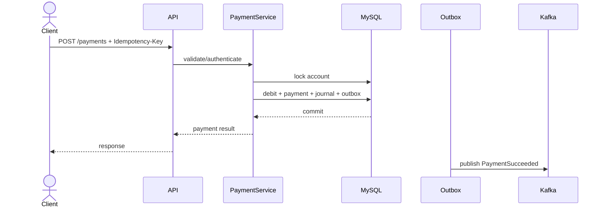

# Architecture

FinClear starts as a modular monolith. The financial write path remains transactionally consistent in MySQL.

## Critical payment path

Redis/Kafka are not the financial source of truth.
